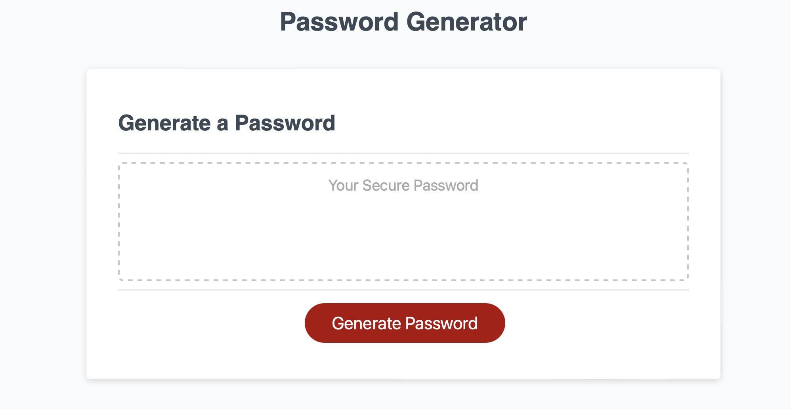
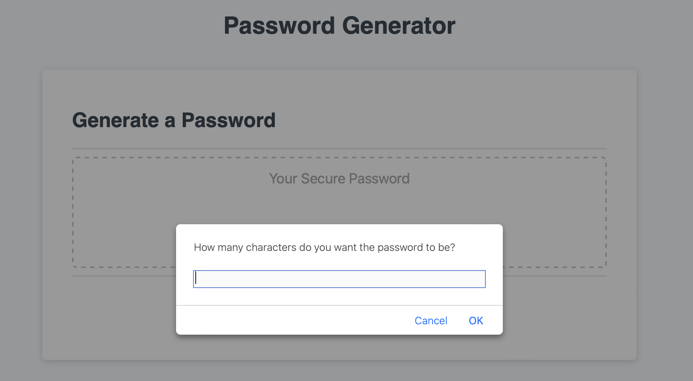
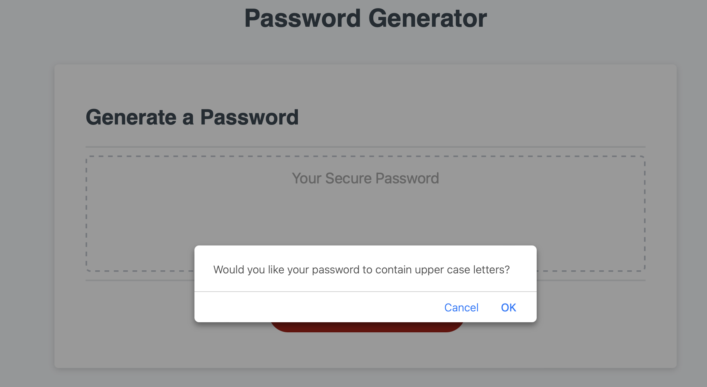
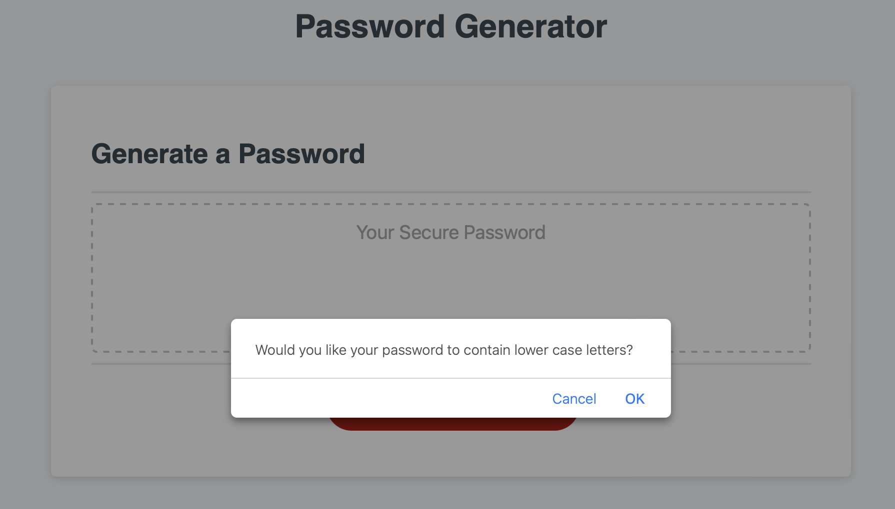
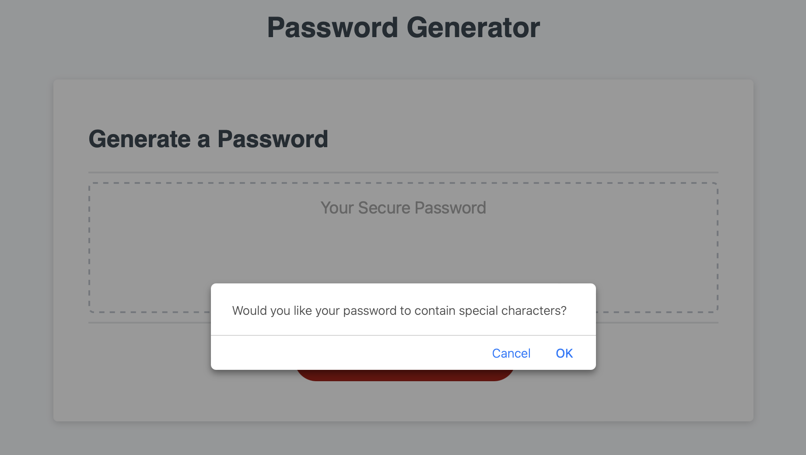
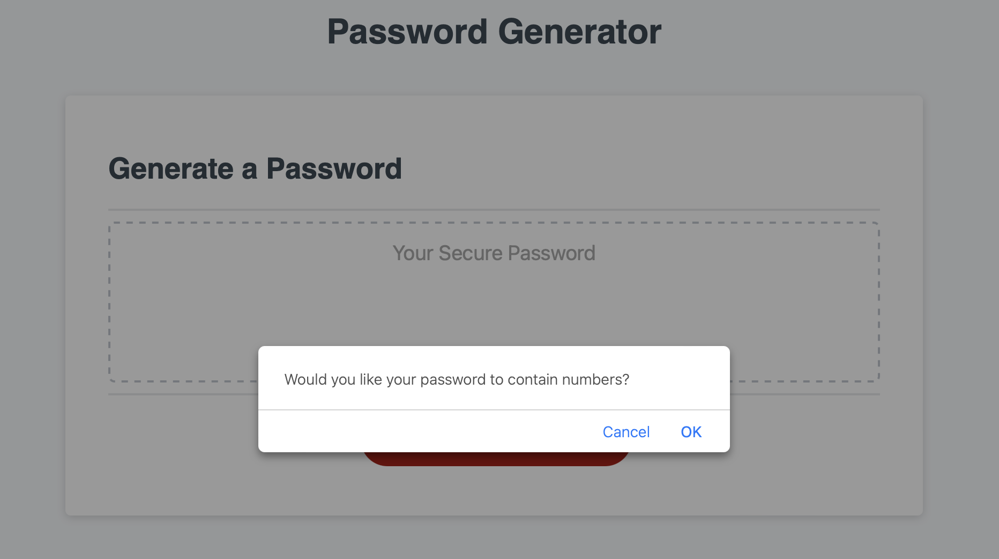
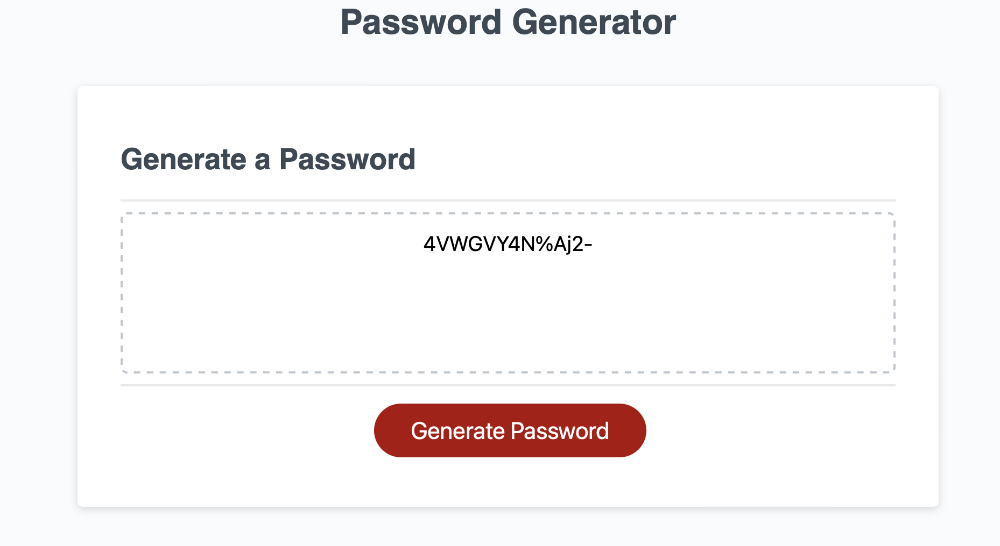

## Password Generator 

## Description
<a href="https://emsaw721.github.io/password-generator/"> Password generator </a> is an application that allows the user to generate a password based on the parameters given. 

## Usage
The password generator provides a password with at least 8 characters, but up to 128 characters. These characters include uppercase and lowercase letters, numbers, and special characters.  

At first, the application user will see the opening page. 

Then, the user will click the red "Generate Password" button. 
This will propt the app to ask how many characters the user wants their password to contain. 

Then the app will ask the user if they would like any of the four items listed: uppercase letters, lowercase letters, special characters, and numbers. 

Finally, the app will generate the password with the parameters the user indicated. 

## Roadmap
Future iterations of this app will provide more special characters, prompts displayed in the website box instead of a popup, as well as some minor aesthetic changes. 

## Authors and acknowledgment
This README was made possible by https://www.makeareadme.com/. 

## License
[MIT](https://choosealicense.com/licenses/mit/)

